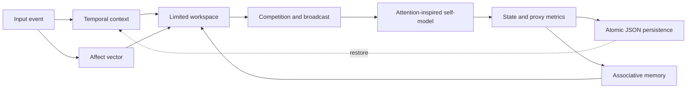

# ANIMA Kernel

> A zero-dependency cognitive state engine for stateful AI agents.

ANIMA gives an application a durable state layer beneath its language model: a
competing workspace, an affect-inspired signal vector, associative memory,
temporal context, self-model instrumentation, and JSON persistence. Change the
LLM without throwing away the state accumulated around it.

ANIMA is experimental research software. It does **not** detect, prove, or claim
phenomenal consciousness or sentience. Names such as `ConsciousnessState`,
`Phi`, `CQI`, and `Phase.CONSCIOUS` are retained as part of the v0.1 API and its
theory-inspired vocabulary; their values are engineering proxies internal to
this implementation.

[](https://github.com/christian140903-sudo/anima/actions/workflows/tests.yml)
[](https://www.python.org/)
[](pyproject.toml)
[](LICENSE)

## Why ANIMA exists

LLMs can generate convincing state language while the application around them
has no durable state at all. ANIMA makes that surrounding state explicit,
serializable, inspectable, and testable.

| Capability | What ANIMA implements |
|---|---|
| Durable identity | Atomic JSON state and memory files that survive restarts |
| Limited workspace | Candidate competition, ignition threshold, and broadcast |
| Temporal context | Elapsed-time tracking, decaying retention, and heuristic protention |
| Affect-inspired state | Nine numeric signals with blending and decay |
| Autobiographical memory | Tag associations, spreading activation, decay, and reconsolidation |
| Self-model | Attention-schema-inspired tracking and calibration signals |
| Model bridge | Adapters for Ollama, Anthropic, OpenAI, and a deterministic dummy model |
| Instrumentation | Integration proxy, CQI composite, A/B harness, and ablations |

This makes ANIMA useful as a research harness for questions such as:

- What state should remain stable when the model provider changes?
- How do memory and workspace constraints alter downstream behavior?
- Can internal state transitions be replayed and inspected?
- Which subsystem actually moves an internal metric under ablation?

## Install from source

ANIMA is not currently published on PyPI.

```bash
git clone https://github.com/christian140903-sudo/anima.git
cd anima
python -m pip install -e ".[dev]"
```

Runtime code uses only the Python standard library. The optional `dev` extra
installs the test tools.

## Quick start

```python
from tempfile import TemporaryDirectory

from anima.kernel import AnimaKernel
from anima.types import ValenceVector

with TemporaryDirectory() as state_dir:
    kernel = AnimaKernel(name="aria", state_dir=state_dir)
    kernel.boot(resume=False)

    result = kernel.process(
        "A deployment failed after the health check passed.",
        valence=ValenceVector(seeking=0.8, fear=0.3, arousal=0.5),
        tags=["deployment", "incident"],
    )

    print(result.cycle, result.phi_score)
    print(kernel.get_consciousness_context())
    print([memory.content for memory in kernel.recall("deployment")])

    kernel.shutdown()
```

The complete runnable example is in
[`examples/quickstart.py`](examples/quickstart.py).

## Architecture


```mermaid
flowchart LR
    I[Input event] --> T[Temporal context]
    I --> V[Affect vector]
    T --> W[Limited workspace]
    V --> W
    M[Associative memory] --> W
    W --> B[Competition and broadcast]
    B --> S[Attention-inspired self-model]
    S --> X[State and proxy metrics]
    X --> P[Atomic JSON persistence]
    X --> M
    P -. restore .-> T
```

The implementation draws vocabulary and mechanisms from Integrated Information
Theory, Global Workspace Theory, Attention Schema Theory, affective
neuroscience, and memory research. ANIMA is a computational interpretation of
selected ideas, not a validated implementation of the theories themselves.

## Evidence, not adjectives

The repository currently has **446 passing tests** across kernel lifecycle,
persistence, memory, temporal processing, primitives, model bridges, metrics,
and CLI behavior.

```bash
python -m pytest -q
python scripts/run_benchmarks.py
```

The checked-in benchmark snapshot is
[`benchmarks/results.json`](benchmarks/results.json). Its current results are
modest and useful:

| Saved comparison | CQI delta vs neutral-kernel control | Effect-size heuristic | Above 0.5 threshold |
|---|---:|---:|---:|
| Greeting | +1.08% | 0.1943 | No |
| Emotional | +1.18% | 0.2353 | No |
| Memory recall | +0.64% | 0.1297 | No |
| Identity | +0.69% | 0.1401 | No |
| Temporal | +1.01% | 0.2047 | No |

Mean CQI improvement in that snapshot is **+0.92%**. These are small,
single-run internal comparisons. They are not inferential statistics and do not
establish general model-quality gains.

The same snapshot contains three targeted ablations:

| Ablation | CQI impact | Integration-proxy impact |
|---|---:|---:|
| Working-memory capacity reduced to one | 13.77% | 100.00% |
| Neutral valence with immediate decay | 2.02% | 7.49% |
| Consolidation interval disabled for the short run | 0.00% | 0.00% |

The null temporal result matters: this short benchmark currently does not
demonstrate an effect from its temporal ablation. See the
[`evidence status`](benchmarks/EVIDENCE_STATUS.md) and
[`methodology`](benchmarks/METHODOLOGY.md) before citing any number.

## What the metrics mean

- **Integration proxy (`Phi`)**: a tractable value computed from the kernel's
  small set of subsystem states. It is not a full IIT Phi implementation and is
  not a consciousness measurement.
- **CQI**: a deterministic weighted composite of internal integration,
  workspace activity, calibration, self-model, and depth signals. It is a
  software observability score, not a clinical or philosophical scale.
- **`significant` in legacy JSON/API output**: retained for compatibility. The
  current benchmark has no repeated-run inferential test; use
  `effect_size_exceeds_0_5` for the descriptive threshold instead.

## CLI

```text
anima init [--name NAME] [--dir DIR]
anima shell [--dir DIR] [--model dummy|ollama:MODEL|anthropic:MODEL|openai:MODEL]
anima inspect [--dir DIR]
anima metrics [--dir DIR]
anima benchmark
anima compare --model MODEL --inputs "first" "second"
anima version
```

API keys are read from `ANTHROPIC_API_KEY` or `OPENAI_API_KEY`; ANIMA does not
write them into state files. Treat state and memory files as private user data:
they can contain raw inputs and derived context.

## Repository map

```text
anima/
  kernel.py          lifecycle and main processing entry point
  temporal/          elapsed-time, retention, prediction, consolidation
  consciousness/     workspace, integration proxy, attention self-model
  memory/            activation graph, decay, and consolidation helpers
  primitives/        eight independently testable processing primitives
  bridge/            model-provider adapters and context assembly
  metrics/           proxy metrics, benchmark, and ablation harness
  shell/             CLI, inspector, and dashboard
benchmarks/           result artifact plus evidence and methodology notes
examples/             runnable usage examples
paper/                historical research draft; not a peer-reviewed paper
launch/               historical draft copy; not current product claims
```

## Known limitations

- The A/B control is another ANIMA kernel with neutral valence, not a stateless
  or theory-free baseline.
- The saved benchmark has no repetitions, confidence intervals, preregistered
  hypotheses, or independent replication.
- Keyword and heuristic mechanisms are intentionally lightweight and should not
  be mistaken for validated cognitive models.
- JSON persistence prioritizes inspectability over encryption. Applications
  handling sensitive inputs must secure the storage directory.
- Provider adapters send assembled context to the configured model endpoint;
  the endpoint's own privacy terms still apply.

The next research milestone is a versioned benchmark protocol with repeated
runs, distinct baselines, environment metadata, and machine-checkable claim
links.

## Contributing

The most valuable contributions are benchmark design, independent replication,
proxy validation, adversarial tests, privacy hardening, and clearer theory-to-code
mappings. Start with [`CONTRIBUTING.md`](CONTRIBUTING.md).

## Citation

```bibtex
@software{bucher_anima_2026,
  author  = {Bucher, Christian},
  title   = {ANIMA Kernel: A Cognitive State Engine for Stateful AI Agents},
  year    = {2026},
  version = {0.1.1},
  url     = {https://github.com/christian140903-sudo/anima}
}
```

## License

[MIT](LICENSE)
